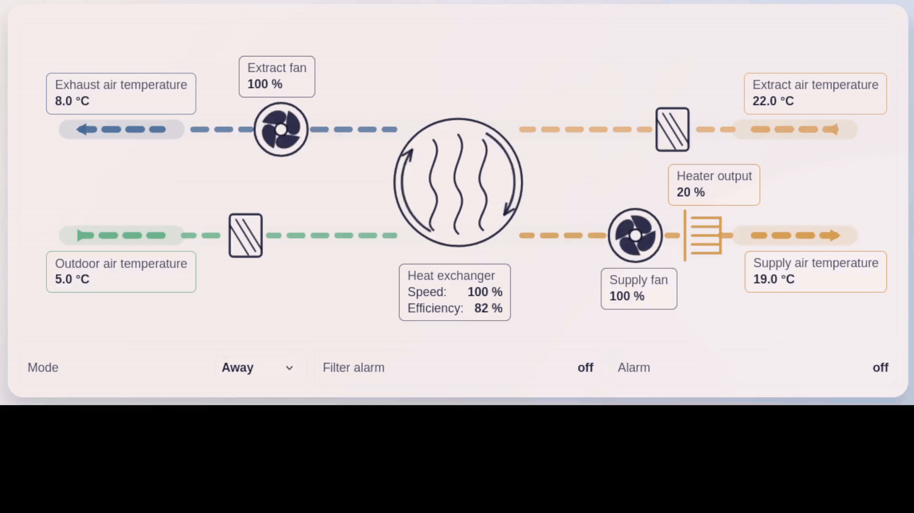
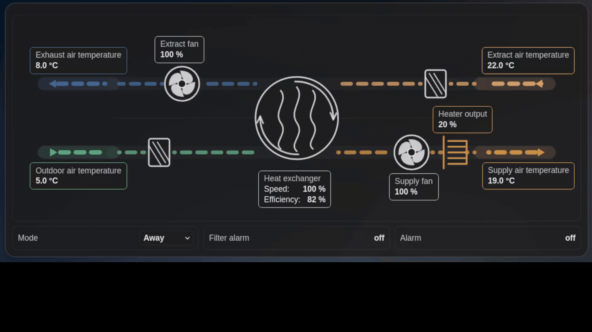
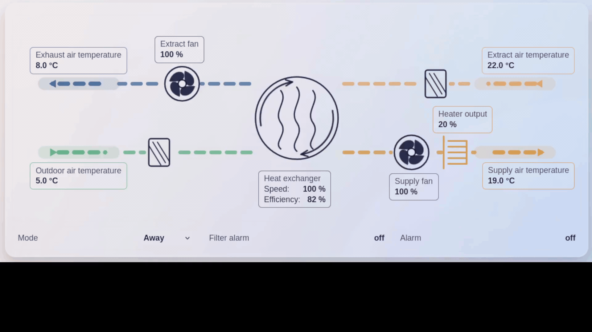
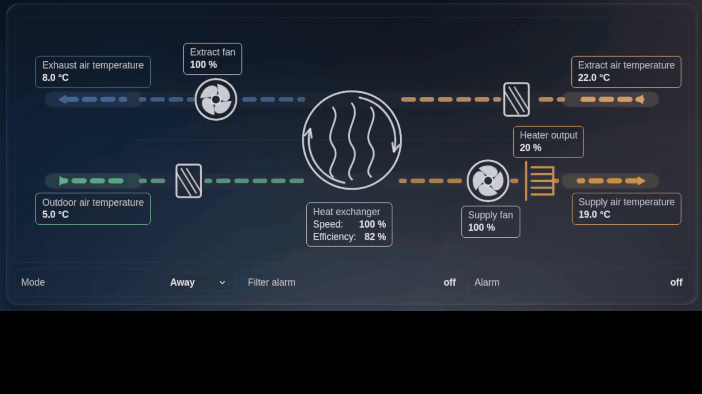

# homeassistant-ventilation-card

A modern Home Assistant Lovelace custom card for visualizing ventilation/AHU systems, inspired by modern industrial SD/BMS and building automation process graphics.

The card is generic and reads configurable Home Assistant entities. Flexit Nordic L6 is an example use case, but the card is intended to support other residential ventilation and AHU systems as well. The card is frontend-only and does not communicate directly with BACnet, Flexit devices, or any ventilation unit.

## Preview

Examples of the card in different Home Assistant themes and transparency modes.

| Light mode | Dark mode |
| --- | --- |
|  |  |

| Transparent light mode | Transparent dark mode |
| --- | --- |
|  |  |

## Features

- Home Assistant Lovelace custom card: `custom:ventilation-card`
- SVG-based ventilation/AHU schematic
- Outdoor, supply, extract, and exhaust air paths
- Rotary heat exchanger, supply fan, extract fan, filters, and heater coil symbols
- Airflow animation with separate supply and extract speed groups
- Compact status row for mode, filter alarm, and alarm
- Clickable configured value boxes and alarm status items that open Home Assistant more-info
- Native mode selection for configured `input_select` mode entities
- Collapsible visual Lovelace UI editor for card configuration, entities, labels, colors, component visibility, animations, and formatting
- English default labels with optional per-component label overrides
- Optional airflow color overrides
- Optional per-sensor/component visibility
- Optional airflow and per-component animation controls
- Optional numeric value formatting
- Optional per-sensor value box border colors and font sizes
- Optional AHU schematic sizing independent of text and value box size
- Optional heat exchanger efficiency from a Home Assistant entity or calculation
- Stable, theme-aware HTML value/status text using Home Assistant CSS variables
- Responsive compact schematic layout at narrow rendered card widths
- Safe handling of missing, `unknown`, or `unavailable` entities

## Installation

### HACS Custom Repository

This repository is prepared for HACS as a Lovelace plugin/custom card repository.

1. Add this repository to HACS as a custom repository.
2. Select the Lovelace category.
3. Install the card.
4. Add the resource if HACS does not add it automatically:

```yaml
url: /hacsfiles/homeassistant-ventilation-card/ventilation-card.js
type: module
```

### Manual Installation

1. Download or build `dist/ventilation-card.js`.
2. Copy it to `www/community/homeassistant-ventilation-card/ventilation-card.js`.
3. Add this Lovelace resource:

```yaml
url: /local/community/homeassistant-ventilation-card/ventilation-card.js
type: module
```

## Lovelace Configuration

```yaml
type: custom:ventilation-card
name: Flexit L6
exchanger_type: rotary
entities:
  outdoor_temp: sensor.flexit_outdoor_temperature
  supply_temp: sensor.flexit_supply_temperature
  supply_temp_before_heater: sensor.flexit_supply_before_heater
  extract_temp: sensor.flexit_extract_temperature
  exhaust_temp: sensor.flexit_exhaust_temperature
  supply_fan: sensor.flexit_supply_fan
  extract_fan: sensor.flexit_extract_fan
  heat_exchanger_speed: sensor.flexit_heat_exchanger_speed
  heat_exchanger_efficiency: sensor.flexit_heat_exchanger_efficiency
  heater_output: sensor.flexit_heater_output
  filter_alarm: binary_sensor.flexit_filter_alarm
  alarm: binary_sensor.flexit_alarm
  mode: input_select.flexit_dummy_mode
layout:
  ahu_size: medium
  compact_breakpoint: 900
efficiency:
  enabled: true
  source: entity
labels:
  supply_temp: Tilluft
colors:
  outdoor_air: "#5fcf9b"
  supply_air: "#f2a93b"
  extract_air: "#f6b66b"
  exhaust_air: "#4f86b8"
component_visibility:
  heater_output: true
animations:
  enabled: true
  airflow_enabled: true
  airflow_max_speed: 100
  stop_when_zero: true
component_settings:
  supply_fan:
    animation_enabled: true
    animation_max_speed: 75
  extract_fan:
    animation_enabled: true
    animation_max_speed: 75
  heat_exchanger_speed:
    animation_enabled: true
    animation_max_speed: 75
value_boxes:
  supply_temp:
    border_color: "#f2a93b"
    font_size: 12
position_offsets:
  supply_temp:
    x: 5
    y: -10
format:
  supply_temp:
    decimals: 1
    show_unit: true
```

Existing configurations without `labels:`, `colors:`, `component_visibility:`, `animations:`, `component_settings:`, `format:`, `value_boxes:`, `position_offsets:`, `layout:`, or `efficiency:` options continue to work.

> **Migration note:** versions up to 0.1.0 used `visibility:` for per-component visibility. Rename that key to `component_visibility:`. Home Assistant reserves top-level `visibility:` for an array of whole-card visibility conditions; using an object there causes `TypeError: conditions.every is not a function` in Home Assistant 2025.4.

Existing configurations that still contain `language:` are accepted, but the setting is ignored.
Existing `layout.size` values are tolerated for compatibility. The visual editor exposes `layout.ahu_size` for schematic sizing.
Existing configurations that contain legacy `value_box:` are accepted as fallback styling, but global value box defaults are no longer exposed in the visual editor.


You can configure the card through YAML or through the built-in Lovelace visual editor.

All fields are optional except `type`. Missing entity mappings render as `—` in the card while preserving layout.
## Configuration

| Option | Type | Default | Description |
| --- | --- | --- | --- |
| `name` | string | `Ventilation` | Card title. |
| `exchanger_type` | string | `rotary` | Heat exchanger style: `rotary`, `crossflow`, or `none`. |
| `show_airflow` | boolean | `true` | Enables animated airflow. |
| `entities` | object | `{}` | Home Assistant entity IDs used by the card. |
| `labels` | object | built-in labels | Optional visible label overrides. |
| `colors` | object | built-in airflow colors | Optional airflow path colors. |
| `component_visibility` | object | visible | Optional per-key show/hide settings. The top-level `visibility` key remains available for Home Assistant's native whole-card conditions. |
| `animations` | object | current animation behavior | Optional global/airflow animation fallback settings. |
| `component_settings` | object | animation fallback settings | Optional per-component animation settings. |
| `format` | object | current HA state formatting | Optional per-key decimals and unit display. |
| `value_boxes` | object | `{}` | Preferred per-entity value frame overrides. |
| `position_offsets` | object | `{}` | Optional per-value-box X/Y fine-tuning offsets added after the active built-in layout placement. |
| `layout.ahu_size` | string | `medium` | AHU drawing size: `small`, `medium`, or `large`; value boxes follow their components while their text and borders remain unscaled. |
| `layout.compact_breakpoint` | number | `900` | Optional rendered-card-width breakpoint in px for switching to compact layout. |
| `efficiency` | object | disabled | Optional heat exchanger efficiency entity or calculation settings. |

## Supported Entities

All entities are optional. If an entity is missing, `unknown`, or `unavailable`, the card displays `—` and keeps the layout stable.

| Entity key | Default label | Description |
| --- | --- | --- |
| `outdoor_temp` | Outdoor air temperature | Outdoor/intake air temperature. |
| `supply_temp` | Supply air temperature | Supply air temperature. |
| `supply_temp_before_heater` | Supply temperature before heater | Optional supply temperature measured before electric heating, used for preferred efficiency calculation. |
| `extract_temp` | Extract air temperature | Extract air temperature. |
| `exhaust_temp` | Exhaust air temperature | Exhaust/avkast air temperature. |
| `supply_fan` | Supply fan | Supply fan speed or signal. |
| `extract_fan` | Extract fan | Extract fan speed or signal. |
| `heat_exchanger_speed` | Heat exchanger | Rotary heat exchanger speed or signal. |
| `heat_exchanger_efficiency` | Heat exchanger efficiency | Optional measured/calculated efficiency entity used when `efficiency.source: entity`. |
| `heater_output` | Heater output | Heater output. |
| `mode` | Mode | Current ventilation mode. |
| `filter_alarm` | Filter alarm | Filter alarm entity. |
| `alarm` | Alarm | General alarm entity. |

## Entity Interaction

When an entity ID is configured, clicking its schematic value box opens Home Assistant's standard more-info dialog. The Filter alarm and Alarm footer items behave the same way, including when the configured entity currently has no available state.

When `entities.mode` is an `input_select` with options in Home Assistant, the Mode footer item displays a dropdown. Selecting an option calls `input_select.select_option` with the configured entity and chosen option. For a non-`input_select` mode entity, the footer falls back to the more-info dialog when an entity ID is configured.

## Heat Exchanger Efficiency

Heat exchanger efficiency is optional and disabled by default, so existing cards retain their previous display until it is enabled. The Heat exchanger editor panel lets you choose the efficiency source: a Home Assistant entity or the card's calculated value.

Use an existing Home Assistant efficiency entity:

```yaml
entities:
  heat_exchanger_speed: sensor.flexit_heat_exchanger_speed
  heat_exchanger_efficiency: sensor.flexit_heat_exchanger_efficiency

efficiency:
  enabled: true
  source: entity
```

Entity mode displays the configured entity state as `Efficiency: 82 %` and does not perform a calculation. Missing, `unknown`, `unavailable`, or non-numeric efficiency entity states display `Efficiency: —`. Percentage entities use zero decimals by default, with `efficiency.decimals` or `format.heat_exchanger_efficiency` available as overrides.

Use calculated efficiency:

```yaml
entities:
  outdoor_temp: sensor.flexit_outdoor_temperature
  supply_temp: sensor.flexit_supply_temperature
  supply_temp_before_heater: sensor.flexit_supply_before_heater
  extract_temp: sensor.flexit_extract_temperature
  exhaust_temp: sensor.flexit_exhaust_temperature
  heater_output: sensor.flexit_heater_output
  heat_exchanger_speed: sensor.flexit_heat_exchanger_speed

efficiency:
  enabled: true
  source: calculated
  has_supply_temp_before_heater: true
  clamp_min: 0
  clamp_max: 100
  decimals: 0
```

For calculated mode, when a valid `entities.supply_temp_before_heater` is enabled, the card uses the preferred supply-side calculation:

```text
((supply_temp_before_heater - outdoor_temp) / (extract_temp - outdoor_temp)) * 100
```

Without a valid pre-heater supply sensor, the card requires a valid heater output. When `heater_output < 1`, it uses:

```text
((supply_temp - outdoor_temp) / (extract_temp - outdoor_temp)) * 100
```

When the heater is active (`heater_output >= 1`), it avoids heater-influenced supply temperature and uses:

```text
((extract_temp - exhaust_temp) / (extract_temp - outdoor_temp)) * 100
```

The calculated result is clamped to `0` through `100` by default and shown inside the heat exchanger value box alongside its speed, for example `Speed: 50 %` and `Efficiency: 82 %`. YAML may override `clamp_min`, `clamp_max`, or `decimals`; otherwise efficiency uses zero decimals, or the heat exchanger formatting decimals when configured. Comma decimal states are accepted. Unknown, unavailable, invalid, non-finite, missing required values, missing heater state when no valid pre-heater sensor is available, or a near-zero denominator display `Efficiency: —`.

For backward compatibility, an existing configuration with `efficiency.enabled: true` and no `efficiency.source` continues to use calculated mode. A configured `source` displays efficiency unless `efficiency.enabled: false` explicitly disables it.

## Optional Labels

The card uses English default labels when `labels:` does not define a key.

Defaults are Outdoor air temperature, Supply air temperature, Extract air temperature, Exhaust air temperature, Supply fan, Extract fan, Heat exchanger, Heater output, Mode, Filter alarm, and Alarm.

Use the optional top-level `labels:` section to override visible text. Custom labels are shown exactly as provided and always override defaults. The visual editor exposes a label text field inside each collapsible sensor/component panel.

## Optional Visibility

Use `component_visibility:` to hide individual value boxes or components. Missing keys are visible by default. If a key is visible but its entity is missing, the card still displays `—`.

```yaml
component_visibility:
  outdoor_temp: true
  heater_output: false
  alarm: true
```

For component keys such as `supply_fan`, `extract_fan`, `heat_exchanger_speed`, and `heater_output`, hiding the key also hides that visual component and its value box. For `mode`, `filter_alarm`, and `alarm`, hiding the key removes the status strip item.

## Optional Airflow Colors

Use `colors:` to override the four airflow paths:

```yaml
colors:
  outdoor_air: "#5fcf9b"
  supply_air: "#f2a93b"
  extract_air: "#f6b66b"
  exhaust_air: "#4f86b8"
```

The visual editor labels these as Outdoor air color, Supply air color, Extract air color, and Exhaust air color.

## Optional Animations

Animation controls are shown in the visual editor near the component they affect. Fan and heat-exchanger animation controls are inside the relevant component panels.

Use `animations:` for airflow and backward-compatible global animation settings. If this section is missing, the card keeps its existing animation behavior.

```yaml
animations:
  enabled: true
  airflow_enabled: true
  airflow_max_speed: 100
  stop_when_zero: true
```

Use `component_settings:` for per-component animation controls:

```yaml
component_settings:
  supply_fan:
    animation_enabled: true
    animation_max_speed: 75
  extract_fan:
    animation_enabled: true
    animation_max_speed: 75
  heat_exchanger_speed:
    animation_enabled: true
    animation_max_speed: 75
```

`animation_max_speed` is a percentage from 0 to 100 and controls how fast the component animates when its entity value is 100%. Use `50` for half speed and `0` to stop that component animation. `stop_when_zero` stops animations when the source value is zero or unavailable. Existing `component_settings.*.animation_speed`, `animations.fans_enabled`, `animations.rotor_enabled`, `animations.fan_max_speed`, and `animations.rotor_max_speed` are still supported as fallbacks.

## Optional Formatting

Use `format:` to round numeric states or hide Home Assistant units per key. Missing formatting keeps the current behavior.

```yaml
format:
  outdoor_temp:
    decimals: 1
    show_unit: true
  supply_fan:
    decimals: 0
    show_unit: true
```

`decimals` applies only to numeric states. Non-numeric states are displayed as-is. `show_unit: false` hides `unit_of_measurement`.
Numeric entity states whose Home Assistant unit is `%` display with zero decimals by default. Configure `format.<key>.decimals` to explicitly override that behavior; temperature and other non-percentage states keep their existing state formatting unless configured.

## Optional Value Boxes

Use `value_boxes:` for per-sensor and per-component value frame styling. Text color remains theme-aware.

```yaml
value_boxes:
  outdoor_temp:
    border_color: "#5fcf9b"
    font_size: 12
  heat_exchanger_speed:
    border_color: "#f2a93b"
```

The legacy `value_box:` section is still supported as a fallback for shared `border_color` and `background_color`, but the visual editor now focuses on per-sensor `value_boxes`. Per-item `value_boxes.<key>.border_color` overrides `value_box.border_color`.

## Optional Position Tuning

The card includes built-in tuned value-box positions for both wide and compact layouts. Use `position_offsets:` only to fine-tune those defaults while keeping the anchor-based layout. Offsets are added after the built-in position for the active layout; positive `x` moves a box right, negative `x` moves it left, positive `y` moves it down, and negative `y` moves it up.

```yaml
position_offsets:
  supply_temp:
    x: 5
    y: -10
```

The visual editor exposes Position X offset and Position Y offset for temperature, fan, heat exchanger, and heater value boxes. These optional fields are additional fine-tuning adjustments and work in both wide and compact layouts at every AHU size. A null, empty, or invalid X/Y value is treated as `0`. Remove temporary tuning values previously used to establish the defaults before assessing the built-in layout, otherwise they will be added again.

## Optional AHU Size

Set the schematic size without changing value box frames or text:

```yaml
layout:
  ahu_size: medium
  compact_breakpoint: 900
```

The visual editor provides Small, Medium, and Large options. Their AHU drawing scales are `75%`, `100%`, and `125%`; Large is limited to `125%` so ducts and components remain clean within the card. Value boxes are positioned from their associated duct/component anchors, so they follow AHU size changes while using stable Home Assistant-themed text and border sizes rather than scaling with the SVG. `compact_breakpoint` is optional and lets you tune when compact placement activates. The schematic does not draw a separate faint internal AHU casing outline.

## Dashboard Sizing

The dashboard layout controls card width through `grid_options`; the card preserves user-provided `grid_options` and does not change them at runtime. Home Assistant's documented custom-card grid API exposes sizing recommendations for a standard 12-column Sections grid, so the card does not attempt to force a custom 24-column minimum. For best readability in Sections view layouts that offer a wider column range, use at least 24 columns for this card.

The card observes its rendered width and switches to a compact schematic layout below `layout.compact_breakpoint`, defaulting to `900px`. Use the visual editor setting to keep compact placement active at wider intermediate card widths when appropriate for a dashboard. Compact mode uses a reduced-height schematic and tighter separated label rows rather than oversized vertical spacing. Value box and footer text uses the Home Assistant theme font family and a stable `14px` default size, so compact mode does not reduce text to unreadable SVG-scaled sizes. Individual configured `value_boxes.<key>.font_size` overrides remain available for values.

## Development

```bash
npm install
npm run build
```

The built card is generated at `dist/ventilation-card.js`.

## Notes

- This is a frontend-only Lovelace card.
- The card reads Home Assistant entity states and invokes standard Home Assistant UI/service interactions such as more-info and `input_select.select_option`.
- Missing or unavailable entities render as `—`.
- The card does not perform direct BACnet, Modbus, Flexit, or other device communication; that remains the responsibility of Home Assistant integrations or external systems.
